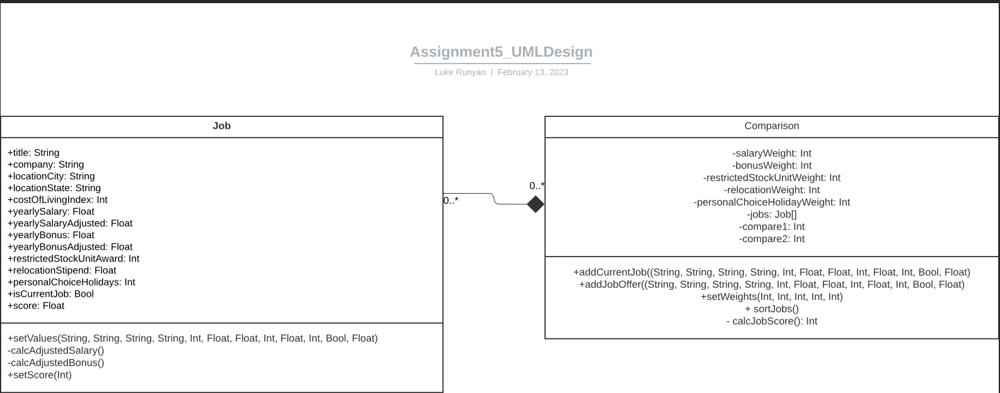
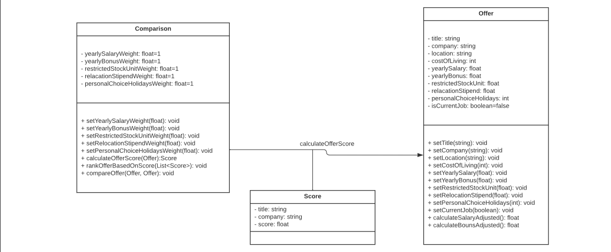
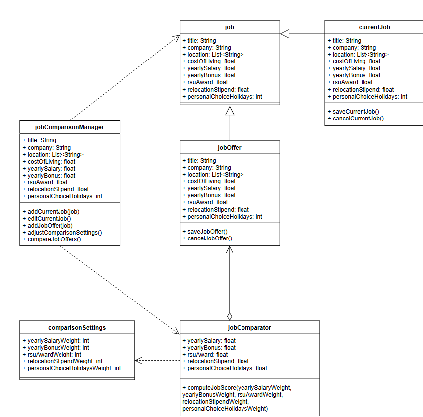
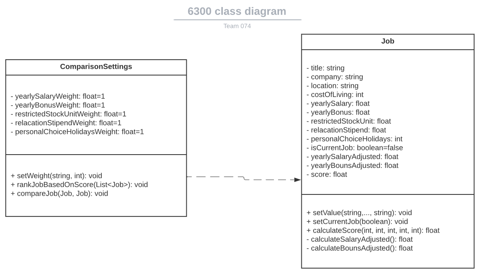

# Design Discussion
## Design 1

> Design 1 UML

### Pros:
The design has all the classes needed: Job and Comparison. And within each class, it has all the attributes needed. All the attribute visibilities and types are clearly indicated. Each class has all the methods required by the situation, and the visibilities, argument types, and method return types are clearly noted in the class diagram. And the relationship between the two classes is represented.
### Cons: 
The attributes in the Job class are all set to be private while the attributes in the comparison class are all set to be public. Generally, the attributes are private. setValue() has too much arguments. addCurrentJob() and addJobOffer() have duplicated functionality, so only one should be kept. 

## Design 2

> Design 2 UML
### Pros:
Appropriate data types are chosen for the attributes (i.e., yearlySalary is a float.) The purpose of each class is clear (operations for updating an offer are limited to the offer class.) All methods needed for a user to enter a job offer are present, and the process for comparing two jobs is well-defined (calling compareOffer() for the Comparison class and calculateSalaryAdjusted()/calculateBonusAdjusted() in the Offer class.) The design is straightforward and easy to understand.
### Cons:
Score is a separate class, with the attributes of title, company, and score. This could cause difficulty in identifying specific jobs when updating weights or ranking job offers. It is possible for multiple job offers to share a title and company but have distinct locations (for example, Software Engineer I at XYZ Corp. in Baltimore, MD and Software Engineer II at XYZ Corp in New York, NY.) If a Score class is to be used, having a unique ID for each job would avoid this confusion. Alternatively, score could be set as an attribute of the Offer class.  

## Design 3

> Design 3 UML

### Pros:
This design did a great job defining a ‘Job’ class that encapsulates all relevant information needed for a job. The design also is explicit in it’s implementation of current job and job offer, making those two things different classes that inherit the attributes from the ‘Job’ class.The design also nicely defines a ‘ComparisonSettings’ class which includes all of the relevant information for making job comparisons as it’s attributes

### Cons:
This design includes a ‘jobComparisonManager’ class that seems unnecessary, and is meant as an interface layer to the UI, but the group decided that this functionality can be accomplished by the UI implementation. Although the design clearly differentiates between a current job and an offer, this also seems to be more complex than is necessary, and instead of having 3 different classes for a job, this could all be combined into one. Similarly with comparison settings, having the settings separated from the comparator seems more complicated than necessary and these attributes could be combined into one class. 

## Team Design

> Team UML Design   

## Summary
In this assignment the team learned the value of discussion and how sharing thoughts and ideas can greatly help in designing UML diagrams. We found that many design ideas we had could be simplified or combined and the process. Having group discussion was also helpful because when one person’s ideas begin to stray from the design intent or begins to focus on UI implementation the other group members can remind them of the focus and to kept design concepts agnostic of UI implementation.
