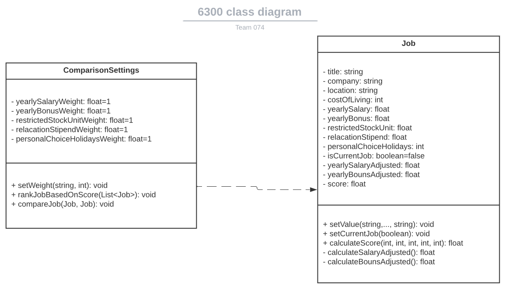
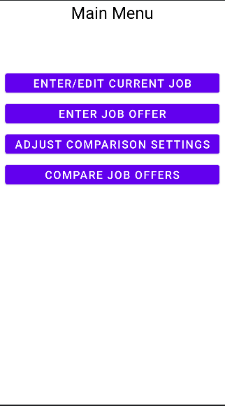
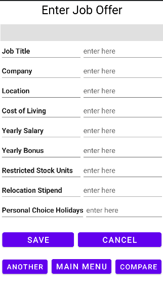
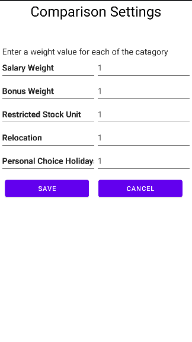
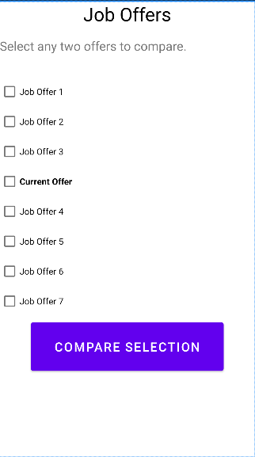
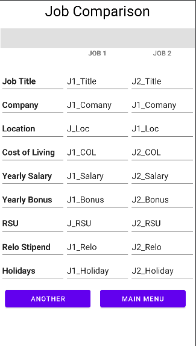

# Design Document

*This is the template for your design document. The parts in italics are concise explanations of what should go in the corresponding sections and should not appear in the final document.*

**Author**: Team074

## 1 Design Considerations

*The subsections below describe the issues that need to be addressed or resolved prior to or while completing the design, as well as issues that may influence the design process.*

### 1.1 Assumptions

*Describe any assumption, background, or dependencies of the software, its use, the operational environment, or significant project issues.*

### 1.2 Constraints

*Describe any constraints on the system that have a significant impact on the design of the system.*

### 1.3 System Environment

*Describe the hardware and software that the system must operate in and interact with.*

## 2 Architectural Design

### 2.1 Component Diagram

There are three components, Comparison, Job Offer and Job offer database. 
Job offer component provides functionalities such as enter and edit job offers. Comparison component provides functionalities such as adjust and compare job offers. And Job offer database component stores the job offers and comparison settings.                                                                               
### 2.2 Deployment Diagram

The diagram shows the deployment of andriod application. There is an apk. Within the apk, there are compiled classes, compiled resources, uncompiled resources, and deployment spec file. The apk will be deployed in Android execution environment. 

## 3 Low-Level Design

*Describe the low-level design for each of the system components identified in the previous section. For each component, you should provide details in the following UML diagrams to show its internal structure.*

### 3.1 Class Diagram

Bellow is a UML diagram describing the different classes that will be implemented in this program.

## 4 User Interface Design

