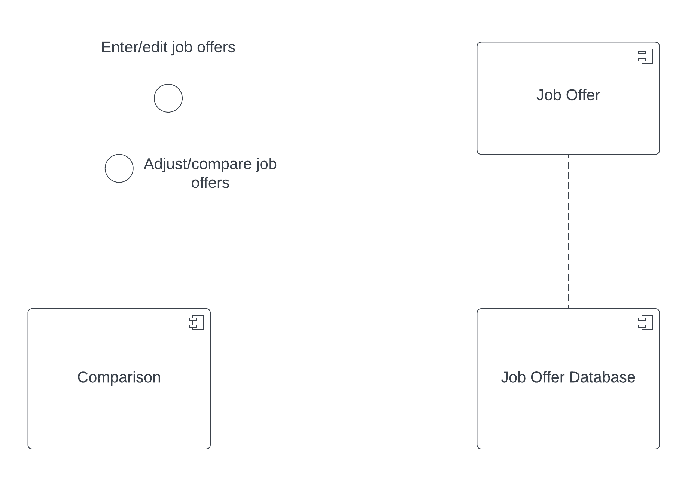
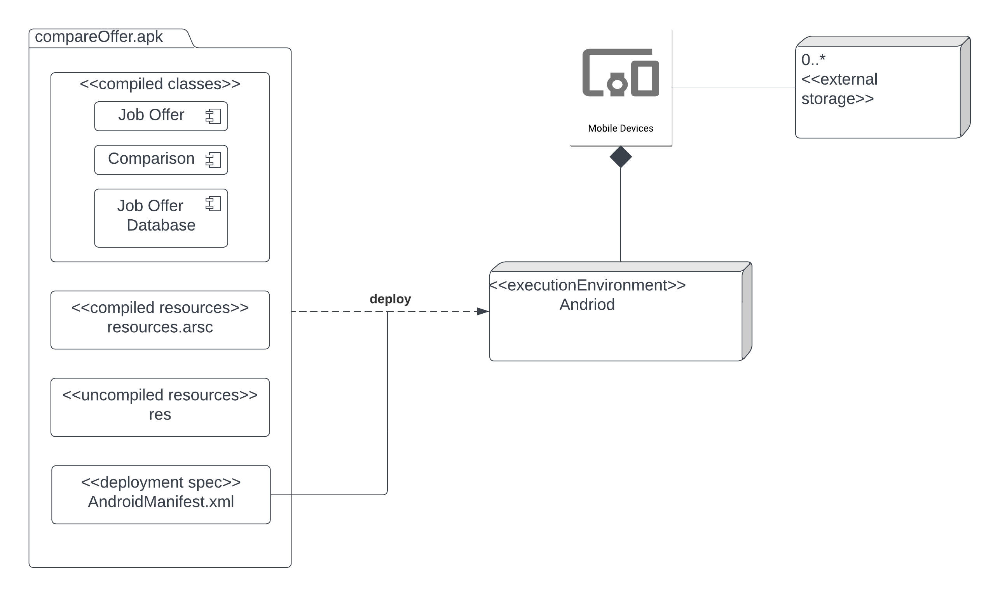

# Design Document

**Author**: Team074

## 1 Design Considerations

### 1.1 Assumptions

The software is a single-user job offer comparison app, programmed in Java 19, that runs the Android 12 operating system. It is assumed that a single system is running the app. The app’s state will persist between runs, and this is accomplished through the use of Android SQLite. One other external dependency is used, which is the cost of living index used to calculate adjusted salaries and bonuses. The software is developed using the Android Studio IDE.

### 1.2 Constraints

The API level is 31 (Android version 12), which impacts several packages: compileSdk, minSdk, and targetSdk. The details of jobs/job offers used for comparisons are entered only by the user. No external data source is used to provide job offer detail information, although adjusted salaries and bonuses are calculated based on a cost of living index. Due to the high amount of user text input required, the UI must be designed such that it is intuitive and responsive.

### 1.3 System Environment

The system is used on a mobile phone (Google Pixel 6) that runs Android 12. The Android operating system is Linux-based and is used for mobile devices, including smartphones and tablets. The Pixel 6 uses a Google Tensor (ARM64) processor and has 8 GB of RAM. Due to Android version 12, the app will run in its own process and instance of Android Runtime.

## 2 Architectural Design

### 2.1 Component Diagram

There are three components, Comparison, Job Offer and Job offer database. 
Job offer component provides functionalities such as enter and edit job offers. Comparison component provides functionalities such as adjust and compare job offers. And Job offer database component stores the job offers and comparison settings.                                                                               
### 2.2 Deployment Diagram

The diagram shows the deployment of andriod application. There is an apk. Within the apk, there are compiled classes, compiled resources, uncompiled resources, and deployment spec file. The apk will be deployed in Android execution environment. 

## 3 Low-Level Design

*Describe the low-level design for each of the system components identified in the previous section. For each component, you should provide details in the following UML diagrams to show its internal structure.*

### 3.1 Class Diagram

*In the case of an OO design, the internal structure of a software component would typically be expressed as a UML class diagram that represents the static class structure for the component and their relationships.*

### 3.2 Other Diagrams

*<u>Optionally</u>, you can decide to describe some dynamic aspects of your system using one or more behavioral diagrams, such as sequence and state diagrams.*

## 4 User Interface Design
*For GUI-based systems, this section should provide the specific format/layout of the user interface of the system (e.g., in the form of graphical mockups).*

