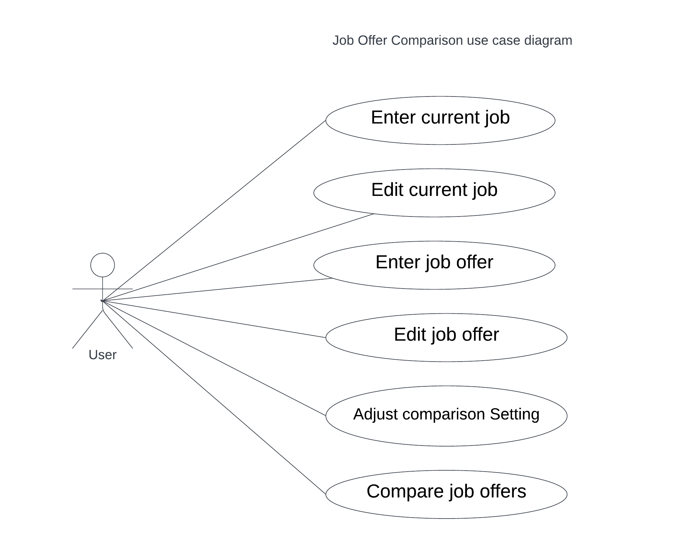

# Use Case Model

**Author**: Team 074

**Version**: 2.0
- Removed template text

## 1 Use Case Diagram

## 2 Use Case Descriptions

### Use case: enter/edit current job

User log in to the system. 
System shows a user interface to enter/edit the details of their current job.
The user enter the job details. 
If the user saves the job details, then the job details will be saved to the system 
If the user exits without saving the job details, the job details won’t be saved to the system.

### Use case: enter/edit job offer
User log in to the system. 
System shows a user interface to enter/edit the details of job offer. 
The user enter the job details. 
If the user saves the job details, then the job details will be saved to the system. 
If the user exits without saving the job details, the job details won’t be saved to the system. 

### Use case: Adjust comparison setting
User log in to the system. 
System shows a user interface to adjust integer weights of Yearly salary, Yearly bonus, Restricted Stock Unit Award, Relocation stipend, and Personal Choice Holidays. 
The user adjusts integer weights. 
If the user saves the integer weights, the adjusted weights will be saved. 
If the user exits without saving the adjusted weights, the adjusted weights won’t be saved to the system. 

### Use case: Compare job offers
User log in to the system. 
System shows a user interface of a list of job offers, displayed as Title and Company, ranked from best to worst based on the weighted score, and including the current job (if present), clearly indicated. 
User selects exact two jobs to compare and trigger the comparison. 
System shows a table comparing the two jobs, displaying details for each job. 
User performs another comparison or goes back to the main menu. 
If there is only one job in the system, system will display the detail of the job. 
If there is no job in the system, system will display an empty table. 

